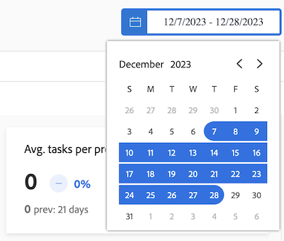
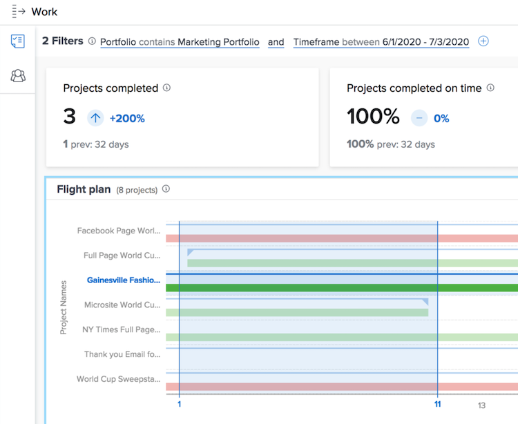

# Understand date ranges and timeframes

When viewing the [!DNL Enhanced analytics] charts, date ranges are specified using the calendar widget. Timeframes are created within a chart when you click and drag to define a specific region, so you can zoom in and get a more detailed look at the information during that timeframe.

## Date ranges

Just click on any date in the calendar to indicate one date in your range, then click on any date to indicate the other end of the range. Use the arrows at the top of the calendar to navigate to a different month if your start and end dates are not in the same month.

 
The charts in [!DNL Analytics] show data for the last 60 days and the next 15 days by default. You can select a new date range and apply it to all of the charts while you're using [!DNL Analytics].

When you refresh the page, navigate away, or log out/in of Workfront, the date range is reset to the default.

## Timeframes

Click and drag around a desired section of a timeline to create a timeframe filter. This timeframe now applies to all of the charts in the Work area, and it appears next to any other filters in the filter bar. Dig deeper into a chart by clicking and dragging around areas to update the timeframe. To remove the timeframe filter just hover over it in the filter bar and click the X that appears.

When you refresh the page, navigate away, or log out of Workfront, the timeframe is removed and the date range is reset.

>[!NOTE]
>
>You cannot use this timeframe option with the Project treemap chart.
