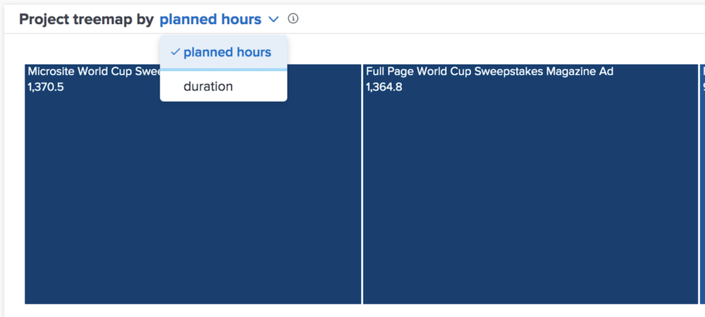

# Understand planned hours and duration views

In the Burndown and Project treemap charts, you can view the information by planned hours or duration, depending on what you consider more accurate for your Workfront environment.

Planned hours is the default. If you switch to duration, this does stick if you navigate away from [!DNL Analytics] and come back and between Workfront logins.

## What does box size and color shade mean?

Smaller, lighter blue boxes indicate fewer hours while larger boxes and darker shades of blue indicate more hours in comparison. For more information see [Understand the Project treemap visualization](https://experienceleague.adobe.com/docs/workfront/using/reporting/enhanced-analytics/project-treemap-overview.html?lang=en).
