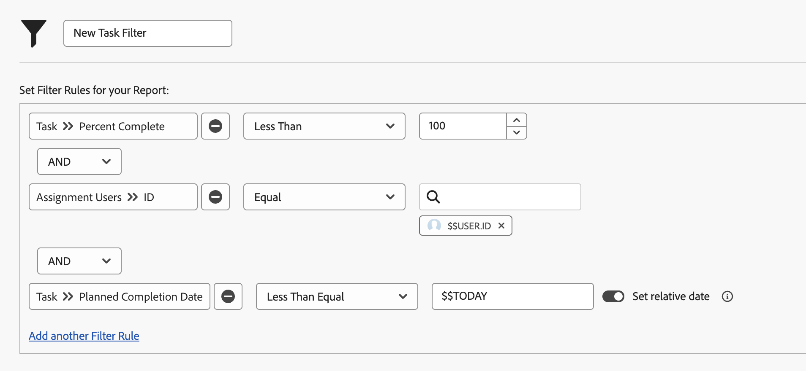

# Create filters with date-based wildcards

In this video, you will learn how to:

* Know when to use date-based wildcards 
* Understand the difference between Workfront's two date-based wildcards 
* Add a date-based wildcard to a filter 
* Create a custom date using wildcards, attributes, operators, and modifiers 
* Create a custom date range using wildcards 

>[!VIDEO](https://video.tv.adobe.com/v/336812/?quality=12&learn=on&enablevpops=0)

## "Create filters with date-based wildcards" activities

### Activity questions

1. How would you build the filter rule if you wanted issues that have a due date of yesterday or today? 
1. How would you build the filter rule to find projects that were due last week? 
1. The following filter rules are part of a task report you use regularly. What type of results would you get from this report?

### Answers

1. Filter on the issue planned completion date between [!UICONTROL $$TODAY-1d] and [!UICONTROL $$TODAY].  
1. Filter on the project planned complete date between [!UICONTROL $$TODAYb-1w] and [!UICONTROL $$TODAYe-1w]. 
1. This report finds tasks assigned to you that aren't yet finished (in other words, have a percent complete less than 100), and that are overdue or due today. The filter rule for the planned completion date of the tasks says to look at tasks that have a due date that is equal to or before today's date.
