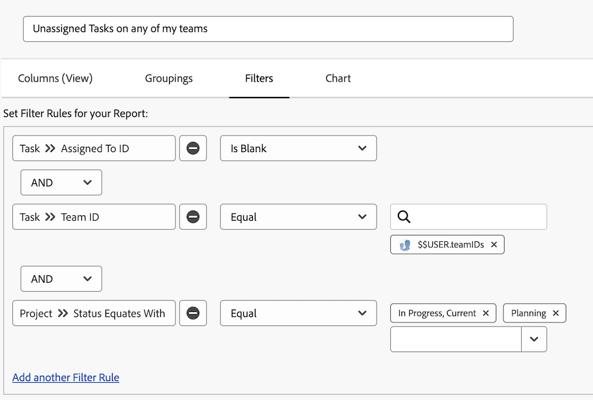
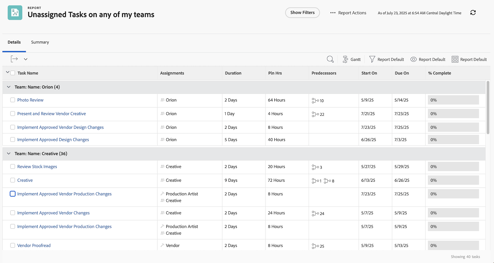

# Explore built-in task filters

In this video, you will:

* Review built-in task filters to see how they're built 
* Learn about some useful task reporting elements 
* Learn how to create your own task filter 

>[!VIDEO](https://video.tv.adobe.com/v/336818/?quality=12&learn=on&enablevpops=0)

## "Understand built-in task filters" activities

### Activity: Create a task report

You want to make sure you are aware of tasks assigned to one of your teams that no one has agreed to work on it yet. Create a task report named "Unassigned Tasks on any of my teams."  

### Answer

Here is what the filter should look like:

Set up your column view to include the fields you're interested in or would like to be able to in-line edit. For example, you could include an Assignments column so you could assign a team member to a task directly from the report. 

You might want to group the list based on the name of the team assigned to each task.

Here is what the report might look like:

