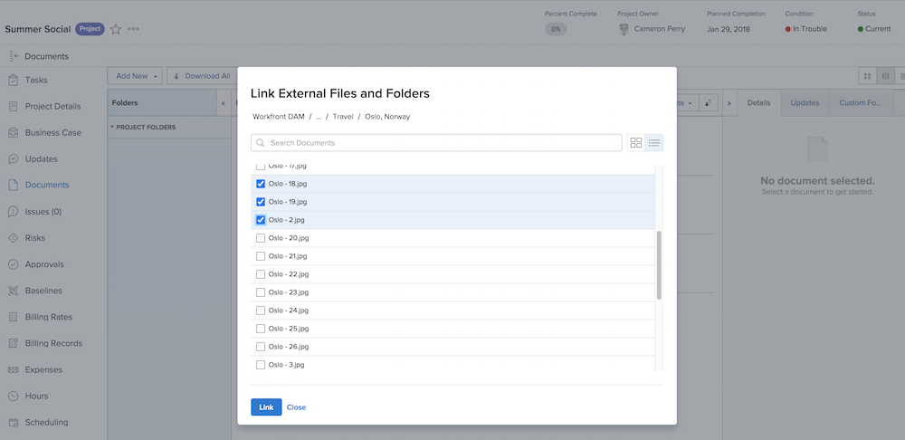

# Add a [!UICONTROL Workfront DAM] link

Start by setting up the connection between the two systems.

1. Log in to [!DNL Workfront].
1. Open a project, task, or issue and click the **[!UICONTROL Documents]** tab.
1. Click the **[!UICONTROL Add New]** button and select **[!UICONTROL From Workfront DAM]** from the drop-down menu.
1. Enter your login name and password in the [!UICONTROL Workfront DAM] authorization box that appears.
1. Next, click **[!UICONTROL Yes]** to give [!DNL Workfront] access to the [!UICONTROL DAM] account.
1. If needed, refresh the page to update the access to [!UICONTROL Workfront DAM].

Now you can put a link to the [!UICONTROL Workfront DAM] item in [!DNL Workfront].

1. Log in to [!DNL Workfront].
1. Open a project, task, or issue and click the **[!UICONTROL Documents]** tab.
1. Click the **[!UICONTROL Add New]** button and select **[!UICONTROL From Workfront DAM]** from the drop-down menu.
    ![An image of the [!UICONTROL From Workfront DAM] option in the [!UICONTROL Add New] drop-down menu](assets/01-contributor-from-workfront-dam.png)
1. A list of files and folders that you have access to in [!UICONTROL Workfront DAM] appears in the window.

1. Find the asset you're looking for and check the box next to it. The default view is a list, but you can switch to a thumbnail view with the icons in the top-right corner of the window.

    

1. Click the **[!UICONTROL Link]** button. A link to the [!UICONTROL Workfront DAM] file appears in the documents list. An icon indicates this link.

    ![An image of the links to the [!UICONTROL Workfront DAM] files appearring in the documents list of [!DNL Workfront].](assets/03-contributor-linked-in-wf.png)
