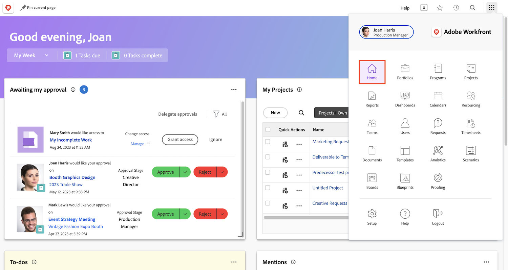

# Workfront for executives

Learn how Workfront can help you manage work in your organization.

As an executive, Adobe Workfront can:

* Keep you informed about the progress of work you're concerned about through **reports and dashboards**
* Give you an easy way to **communicate with project stakeholders using updates**
* Give you an easy way to **make a work request**
* Give you an easy way to see **items awaiting your approval**

## Reports and Dashboards

### Reports

Reports in Workfront are the backbone to making better decisions, faster. You can see them everywhere you go--in the projects area, the people area, or on a task landing page.

Leaders and executives can navigate to the report area to view custom reports with specific information. To increase visibility to the most important reports, Workfront uses dashboards. 

### Dashboards 

By using a dashboard, leaders can view and quickly drill down into any part of the work their organization is currently working on.The dashboard is simply a collection of reports that provide information leaders may need to see on a regular basis. Dashboards are completely customizable so anyone using Workfront can see work that matters to them. 

Click Dashboards from the Main menu icon in the upper-right corner to access the Dashboards area.

Leaders can access the different dashboards available to them from the left panel navigation.

* **All Dashboards**: Displays the dashboards that you or other users have created, and which you have permissions to at least view.
* **My Dashboards**: Displays the dashboards that you have built.
* **Shared Dashboards**: Displays the dashboards that have been created by other users and shared with you.

With a dashboard, leaders are able to review things like "Costs, Revenues & Budgets," for important projects and open issues their teams are dealing with. They can also see projects that are at risk, as well as a list of items that need executive approval.

Reports in Workfront can help drive accountability for your employees. The key to leveraging reports is to establish a clear workflow for the way your organization is using them. Make sure everyone has a clear understanding of which reports are being used to measure success.

Example of reports in a Dashboard in Workfront 

## Communicate with project stakeholders using updates

Communicate with the project team within the project itself so all project communications will be easily accessible.

## Make a request

At many organizations, the first step in kicking off a new project, developing a new product, or creating a deliverable is making a request in Workfront. You can track the progress on the request and provide additional information when needed.

In this video, you will learn how to:

* Navigate to the request area
* Make a request
* View your submitted requests

>[!VIDEO](https://video.tv.adobe.com/v/336092/?quality=12&learn=on)

## Items awaiting your approval

In [!UICONTROL Home] you can easily find items awaiting your approval.

