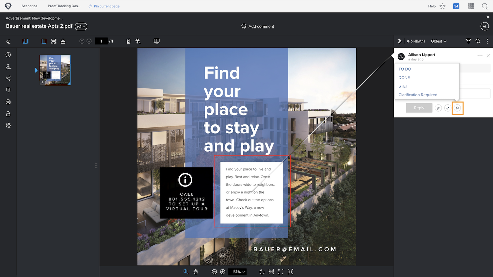

# Manage proof comments

[!DNL Workfront] helps you track and manage work related to each comment on a proof—such as making corrections on the asset—with comment actions or by resolving comments.

Proof actions are a “flag” or “label” on a comment and are often used to indicate an action has been taken or needs to be taken regarding the comment. Actions can be selected from the icon or the More menu on each comment.

For example, you’re responsible for deciding which of the corrections made during the review process should actually be done. Using an action, you can mark the relevant comments, letting a designer or editor know which revisions to make. That person can then use another action to indicate the changes were made.

![An image of a proof in the proofing viewer with the [!UICONTROL To Do] proof action highlighted on the comment.](assets/manage-comments-2.png)

If you don’t see actions listed on your comments, then your organization hasn’t set them up. Talk with your proofing system administrator if you think actions are something your organization should use.

The “resolve comment” feature is commonly used to indicate a comment has been addressed in some manner—a correction has been made or a question has been answered. Some [!DNL Workfront] customers “resolve” a comment when it’s a correction that doesn’t need to be made or it’s just a comment that has been read.

Resolve the comment by clicking the checkmark icon. This places a green checkmark on the comment, which makes it easy to identify which comments have been reviewed as you scan through the comments column.

You can filter the comments column by both of these features, helping you curate what you see as you work with the proof.

![An image of the comment filters in the proofing viewer with the [!UICONTROL Actions] and [!UICONTROL General] filtering options highlighted.](assets/manage-comments-3.png)

<!--
## Learn more
* Create and manage proof comments
-->
