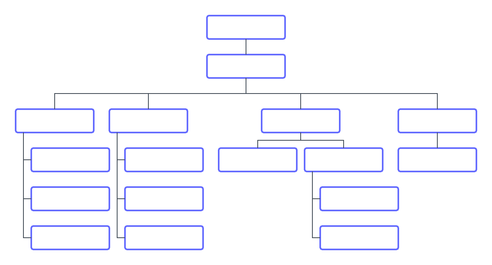

# Understand how [!DNL Workfront Goals] works

In this video, you will learn about:

* Articulating the "what" and the "why" during the planning phase
* Example goals
* Scope of influence

>[!VIDEO](https://video.tv.adobe.com/v/335183/?quality=12&learn=on&enablevpops=1)

## Designate accountable individuals

Before you begin configuring [!DNL Workfront Goals], you need to identify the individuals in your organization who will be accountable for leading the achievement of each goal.

There are a few ways to do this. [!DNL Workfront] recommends sketching out your organization chart. There likely will be several layers of goal owners. Start with top-level leadership, then identify the teams and team members responsible for executing the work required to deliver these desired results. They need context of what goals they are working toward in order to produce their best work. 

Next, take a step back and look at your people. Determine who needs full manage/edit access, view only access, and no access at all. The number with no access at all should be relatively small, as most everyone will at least need to view goals for strategic context. 

>[!NOTE]
>
>When identifying the primary goal owners, take into consideration that you are setting strategic goals for enterprise outcomes, not personal development goals. Workfront recommends you only add developmental goals that directly contribute to or drive business and enterprise goals.

We'll show you how to set up and configure your settings in [!DNL Workfront Goals], Part 2: Create and manage your goals. 

<!--
URL for part 2 reference above
-->
