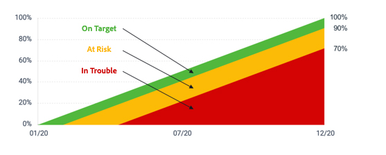

# Calculate goal progress

[!DNL Workfront Goals] calculates goal progress and displays the following information:

* **Actual percent complete**—How much of the goal has actually been completed so far. This value is an average of the percent complete of all progress indicators associated with the goal.
* **Expected percent complete**—How much of the goal should be completed, at this point in time, in order for the goal to be completed on time. This value is calculated by the duration of the goal (total number of days) and the current moment in time (total number of days passed since the goal start date).
* **Progress**—The progress is a label that indicates whether the goal is on target to be completed on time, or if it is at risk or in trouble of not completing.

![A screenshot of goal progress in [!DNL Workfront Goals]](assets/13-workfront-goals-percent-complete.png)

The following chart illustrates the relationship between the goal progress labels and the progress percentage:

The progress of your goal is a good way to get an idea of where your goal is at in terms of reaching completion based on updates you put into the system. This is why it is so important to update your activities and results in Goals. Progress labels help communicate a standardized status to the rest of the organization.

![A graphic covering the different progress labels in [!DNL Workfront Goals]](assets/15-workfront-goals-progress-bar-code.png)

 
>[!TIP]
>
>For more information about the formulas used to calculate goal progress, explore this article: [Overview of goal progress and condition in Adobe Workfront Goals](https://experienceleague.adobe.com/docs/workfront/using/adobe-workfront-goals/goal-management/calculate-goal-progress.html?lang=en#overview-of-goal-progress-and-threshold).

