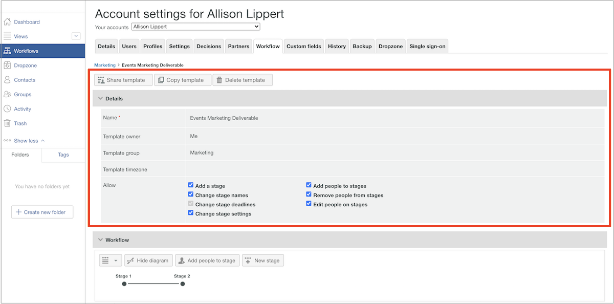
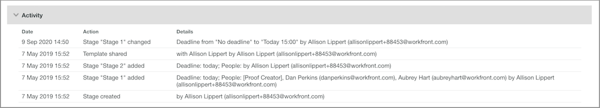

# Edit an automated workflow template

As proof review and approval processes are refined or organizational changes are made, automated workflow templates should be updated to reflect current operations for your teams using Workfront.

Keeping templates up to date ensures consistency in your review and approval processes, plus saves time for those uploading proofs, because they don't have to constantly tweak a workflow.

1. Select **[!UICONTROL Proofing]** from the **[!UICONTROL Main Menu]** in [!DNL Workfront].
1. From there, select **[!UICONTROL Workflows]** in the left panel menu.
1. Click the 3-dot menu to the far right of the template name and select **[!UICONTROL View template details]**.

Options for sharing, copying, and deleting the template are across the top of the template details window for each template. Deleting a template doesn't affect proofs in progress that have that template applied, but it does mean the template isn't available to use anymore.

Click the arrow to the left of the word "[!UICONTROL Details]" to expand or collapse the section.

## Make changes to stages and recipients

Changes might be needed in the [!UICONTROL Workflow] area when a streamlined process means an earlier deadline or when someone joins the team and will be reviewing proofs.

Each stage of an automated workflow has its own section, which allows for deadlines, privacy, proof recipients, and other information to be modified independently.

This video demonstrates some of the changes you can make in the [!UICONTROL Workflow] area. Refer to the bulleted list under this video, which reviews these settings.

>[!VIDEO](https://video.tv.adobe.com/v/335131/?quality=12&learn=on&enablevpops=1)

As a review, here are the proof template changes you can make in the [!UICONTROL Workflow] section:

* Click into the stage name field or the deadline field to update that information.
* Click the arrow at the left of the deadline to lock the stage, determine when the stage is activated, or require only one decision.
* In the recipients list, click into the [!UICONTROL Role] or [!UICONTROL Email alerts] fields to select another option.
* Go to the 3-dot menu to the far-right of a recipient's name to delete them from the list, make them the primary decision maker for that workflow stage, or edit the proof role and email alert information.
* You have two options to add recipients to the list.
     1. At the top-right corner of each stage section, go to the [!UICONTROL More] menu and select [!UICONTROL Add people to stage]. Once you've opened the [!UICONTROL Add people to stage] window, click which stage to add them to. Then enter their name or email address in the recipients list and assign a proof role and email alert. Click the [!UICONTROL Add people] button when you're done.
     1. At the top of the [!UICONTROL Workflow] area, select [!UICONTROL Add people to stage].

## Template sharing

The [!UICONTROL Shared With] area displays the proof users who can use the template. Remove people who no longer need to use the template by clicking the 3-dot menu to the far-right of their name and selecting [!UICONTROL Remove].

![[!UICONTROL Shared With] list](assets/proof-system-setups-edit-template-shared-with.png)

However, you cannot add people to the sharing list from this section. To do this, go back to the top of the template details window and click the [!UICONTROL Share template] button.

## Additional information

[!DNL Workfront] keeps an audit history of when changes were made to the template. You can see the date, who made the change, and some brief information about what changes were made.

This section does not record information about when the template was used on proofs.

