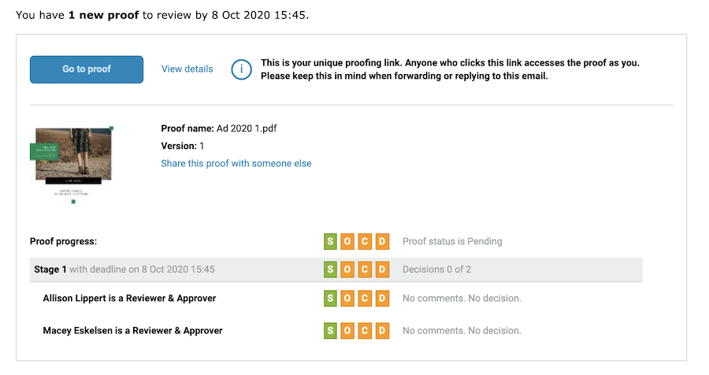
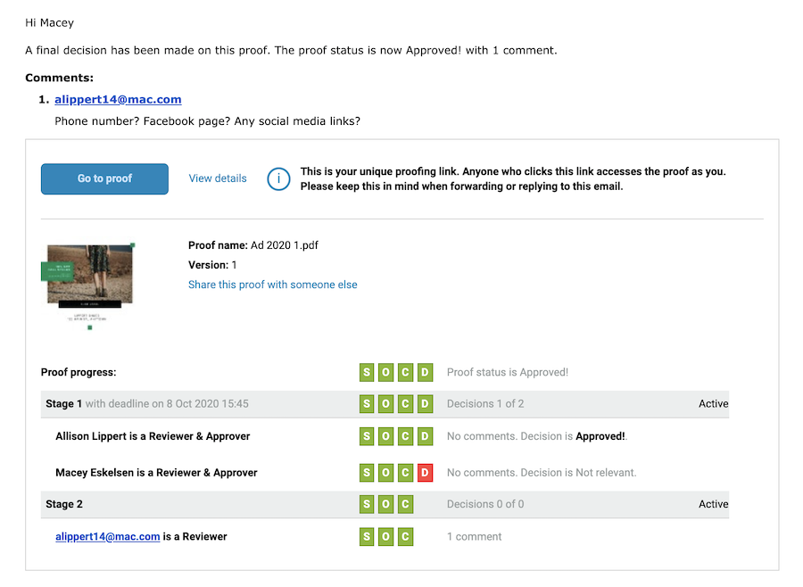

# Understand email alerts and proof notifications

Email alerts are different from proof notification emails. You'll receive a proof notification email when you've been assigned a new proof to review, when a proof is late, or when there's a new version of the proof for you to look at.

If you turn off the notification option when uploading a proof, then no one receives any communication from [!DNL Workfront] about there being a new proof to review.

Email alerts are set per reviewer/approver, most often as the proof is uploaded. A default email alert type may be assigned to your proof recipients so you don't have to set it each time you upload a proof. Talk to your system administrator about getting these defaults set.

Even if email alerts are set to [!UICONTROL Disabled], proof recipients are still notified of a new proof or version.

## Best Practices

| Best Practice | Here's why |
|---|---|
| Disable the "Send emails from Workfront when a comment is made on a proof" setting in the Workfront setups | When this setting is enabled (which it is by default), users have the potential to get multiple email notifications for each comment on a proof—one from the proofing functionality and one from Workfront itself. These duplicate notifications lead to email notification disruption and confusion, as well as a full email inbox, which may ultimately result in users ignoring proof notifications they receive. Which, in turn, could mean missed deadlines.    Note: This setting is found in the Workfront Main Menu > Setup > Email > Review and Approval. |

