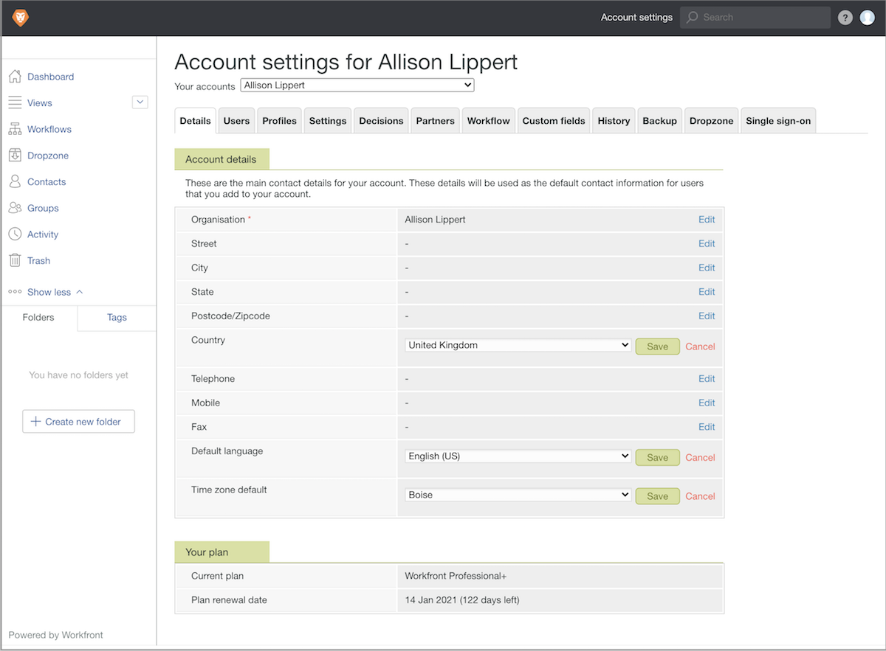

# Set up proof account default settings

Establish default account settings that apply globally to all proofs and proofing users—country, language, and time zone. If you have users across multiple time zones or countries, you can adjust these settings on each individual's user profile, if needed.

1. Select **[!UICONTROL Proofing]** from [!DNL Workfront's] [!UICONTROL Main Menu].
1. Select **[!UICONTROL Account Settings]** in the top navigation bar.
1. Select the **[!UICONTROL Details]** tab.
1. Go to [!UICONTROL Country] field and select **[!UICONTROL Edit]**. Choose the country the majority of your proofing users are in as your default.
1. Select **[!UICONTROL Save]** for that setting.
1. Go to the [!UICONTROL Default language] field and select **[!UICONTROL Edit]**. Choose the language the majority of your proofing users will use as the default.
1. Select **[!UICONTROL Save]** for that setting.
1. Go to the [!UICONTROL Time zone default] field and select **[!UICONTROL Edit]**. Choose the time zone the majority of your proofing users will be in as the default. This will be the time zone recognized by proof workflows that are set up manually. It also will apply to proof workflow templates, but each template can have a time zone set.
1. Select **[!UICONTROL Save]** for that setting.

## Best Practices

| Best Practice | Here's why |
|---|---|
| Adjust the proof back-end settings so users see deadlines in a 12-hour clock format. | Select the F j, Y, gi:a option in the proof settings for users who want to see proof deadlines/times in a AM/PM format. For areas that use a 12-hour clock, this helps with deadline clarity.    Note: This setting is found by going to the Workfront Main Menu > Proofing > Account Settings > Users > and editing the Date format field for each user. |
| Establish a default proof deadline as part of the system settings.|When a default proof deadline is set—the upload date + x number of business days—if the proof creator forgets to add a deadline, Workfront automatically applies this deadline to every proof uploaded.    Note: This setting is found by going to the Workfront Main Menu > Proofing > Account Settings > Settings > Proof Defaults > Deadline (+ business days) field.|
| Hide the Not Relevant proof decision option.| This decision option often causes confusion among approvers, as organizations often don't define when the Not Relevant option should be used. The Not Relevant option generally indicates the proof is not relevant to the proof recipient and they do not need to make an approved or rejected decision. By selecting Not Relevant, this allows the proof workflow to continue.   The Not Relevant option is not needed in most proof workflows.   Note: This setting is found by going to the Workfront Main Menu > Proofing > Account Settings > Decisions.|
| Do not reorder the proof decision options in the proof settings. | Each proof decision setting holds a specific value/weight that, if re-ordered, can throw confusion into your proof configurations. The decision order and value/weight are used as proof stage activation triggers and in reporting.   Note: This setting is found by going to the Workfront Main Menu > Proofing > Account Settings > Decisions.|
| Set user defaults for proof roles and email alerts.| These settings populate automatically when assigning a proof workflow, speeding up the process, and contributing to consistency across proof workflows.   Note: User default settings are found by going to the Workfront Main Menu > Proofing > Account Settings > Users > and selecting the user to set defaults for.|
